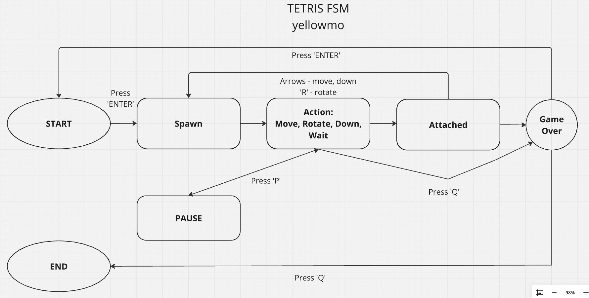
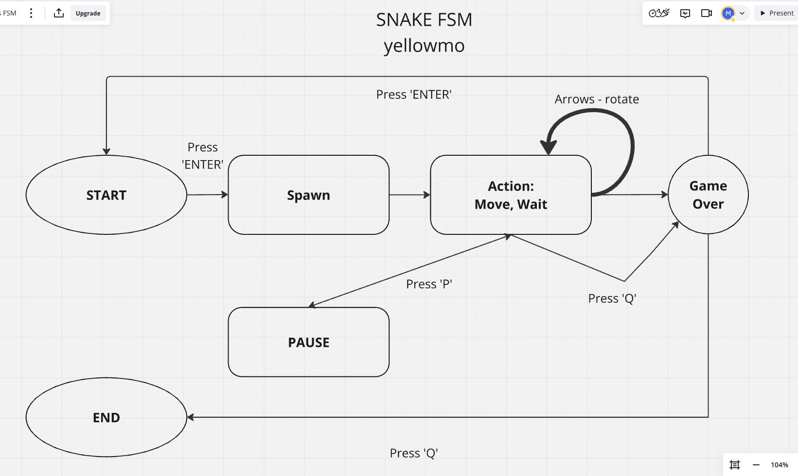

# Документация проекта BrickGame v2.0

## Оглавление 
- [Введение](#введение)
- [Tetris](#tetris)
  - [Управление](#управление)
  - [Модуль GUI](#модуль-gui)
- [Snake](#snake)
  - [Управление](#управление-1)
  - [Модуль GUI](#модуль-gui-1)
- [Сборка и запуск](#сборка-и-запуск)

## Введение 

Этот документ содержит описание проекта BrickGame_v2.0 

## Tetris

### Управление

- Старт игры: клавиша 'Enter'
- Движение фигуры: клавиши 'Down', 'Left', 'Right'
- Поворот фигуры: клавиша 'R'
- Пауза: клавиша 'P'
- Выход из игры: клавиша 'Q'

### Модуль GUI

Взаимодействие интерфейса происходит с помощью концепции Конечного автомата (КА). Используемый КА для данного проекта:

Конечный автомат состоит из модулей:

__Start__ - состояние, в котором игра ждет, пока игрок нажмет кнопку готовности к игре

__Spawn__ - состояние, в которое переходит игра при создании очередного блока и выбора следующего блока для спавна.

__Action__ - основное игровое состояние с обработкой ввода от пользователя, здесь происходит поворот блоков/перемещение блоков по горизонтали и ускоренное падение вниз или истечение таймера

__Attached__ - состояние, в которое преходит игра после «соприкосновения» текущего блока с уже упавшими или с землей. Если образуются заполненные линии, то она уничтожается и остальные блоки смещаются вниз. Если блок остановился в самом верхнем ряду, то игра переходит в состояние «Game Over» в противном случае возвращается к состоянию "Spawn"

__Pause__ - состояние паузы, ничего не происходит пока игрок не снимет паузу

__GameOver__ - игра окончена

## Snake

### Управление

- Старт игры: клавиша 'Enter'
- Движение змейки: клавиши 'Down', 'Up', 'Left', 'Right'
- Ускорение змейки: клавиша 'R'
- Пауза: клавиша 'P'
- Выход из игры: клавиша 'Q'

### Модуль GUI

Взаимодействие интерфейса происходит с помощью концепции Конечного автомата (КА). Используемый КА для данного проекта:

Конечный автомат состоит из модулей:

__Start__ - состояние, в котором игра ждет, пока игрок нажмет кнопку готовности к игре

__Spawn__ - состояние, в которое переходит игра при поедании змейкой яблока и генерации нового яблока.

__Action__ - основное игровое состояние с обработкой ввода от пользователя, поворот змейки. 
Возвращается в состояние "Action" после истечения таймера, если не наступило состояние "Game Over".

__Pause__ - состояние паузы, ничего не происходит пока игрок не снимет паузу

__GameOver__ - игра окончена

## Сборка и запуск

Сборка происходит с помощью мейкфала, основные цели: 
- make: компиляция консольной и десктоп версии
- make cli: компиляция консольной версии
- make desktop: компиляция десктопной версии
- make install: компиляция консольной и десктопной версии
- make uninstall: удаление скомпилированной консольной и дескотоп версии
- make start_cli: запуск консолной версии
- make start_desktop: запуск десктопной версии
- make dvi: открытие докуменации
- make dist: создает сжатый tar-архив текущей сборки проекта
- make gcov_report: генерация отчета в html на основе unit-тестов
- make clean: удаление всех файлов, создаваемых в процессе компиляции предыдущих целей

Для запуска игры, необходимо открыть файл:
- BrickGame_v2_cli для консольной версии
- BrickGame_v2_desktop для десктоп версии
